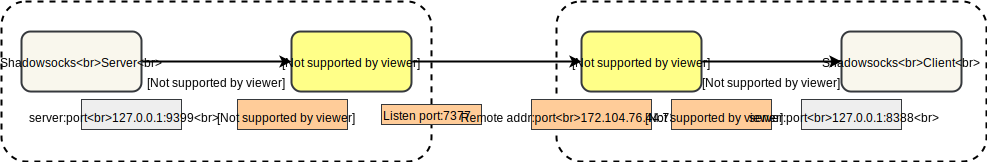

## Shadowsocks&Kcptun配置

1. 安装Shadowsocks和Kcptun
   1. `sudo apt install shadowsocks`，会自动生成`/etc/default/shadowsocks`、`/etc/init.d/shadowsocks`、`/etc/shadowsocks/conf.json`；
   2. `wget https://github.com/xtaci/kcptun/releases/download/v20190515/kcptun-linux-amd64-20190515.tar.gz `，解压后把`server_amd64`放入`/usr/bin/kcptun_server`；
2. 把`etc/shadowsocks/config.json`放入对应位置`/etc/shadowsocks`
3. 把`etc/kcptun`和`/etc/default`下面的文件放入对应位置；
4. 设置开机自启`kcptun`
   1. 把`etc/init.d/kcptun`放入对应位置`/etc/init.d/`
   2. 执行`systemctl enable kcptun`
   3. 使用`service kcptun start|stop|restart`启动|停止|重启`kcptun`

Kcptun和Shadowsocks之间的连接关系

