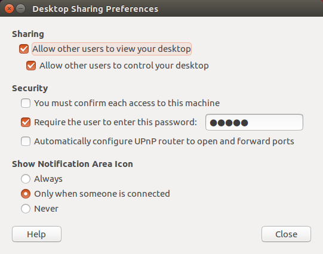
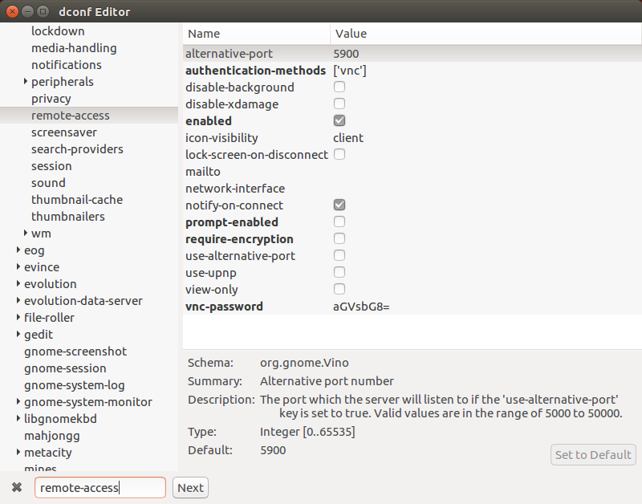

# Ubuntu tips

## macOS远程桌面连接到Ubuntu

1. 配置`Desktop sharing`

   

   `Require the user to enter this password`必须要填一个密码。

2. 安装`dconf-editor`

   ```shell
   sudo apt install dconf-editor
   ```

3. 禁用加密，取消勾选`require-encryption`

   

4. 使用macOS自带的`Screen sharing`应用连接，输入密码为步骤1中设置的密码

   ```shell
   vnc://allen@192.168.1.23
   ```

## 在Ubuntu 16.04中安装Nvidia RTX 2080驱动

1. 禁用开源驱动`nouveau`，启用`nvidia`：

   ```shell
   # 启用nvidia驱动
   sudo sed -i 's@blacklist nvidiafb@#blacklist nvidiafb@g' /etc/modprobe.d/blacklist-framebuffer.conf
   # 禁用nouveau
   sudo echo "blacklist nouveau
   options nouveau modeset=0" >> /etc/modprobe.d/blacklist-nouveau.conf
   ```

   更新内核

   ```shell
   sudo update-initramfs -u
   ```

2. 关闭桌面服务（不关闭桌面服务会出现很多问题，比如安装完成后无法登陆系统）

   ```shell
   sudo service lightdm stop
   ```

3. 安装驱动

   ```shell
   sudo ./NVIDIA-Linux-x86_64-410.57.run
   ```

   安装过程中会有一个`pre-install script failed`提示，直接跳过继续安装，安装完成后重启。

> Nvidia驱动和CUDA版本兼容性：[Compatibility between nvidia driver and CUDA](https://github.com/NVIDIA/nvidia-docker/wiki/CUDA)

在没有安装驱动的情况下查看GPU型号的方法：

```shell
sudo update-pciids
sudo lshw -C display
```

